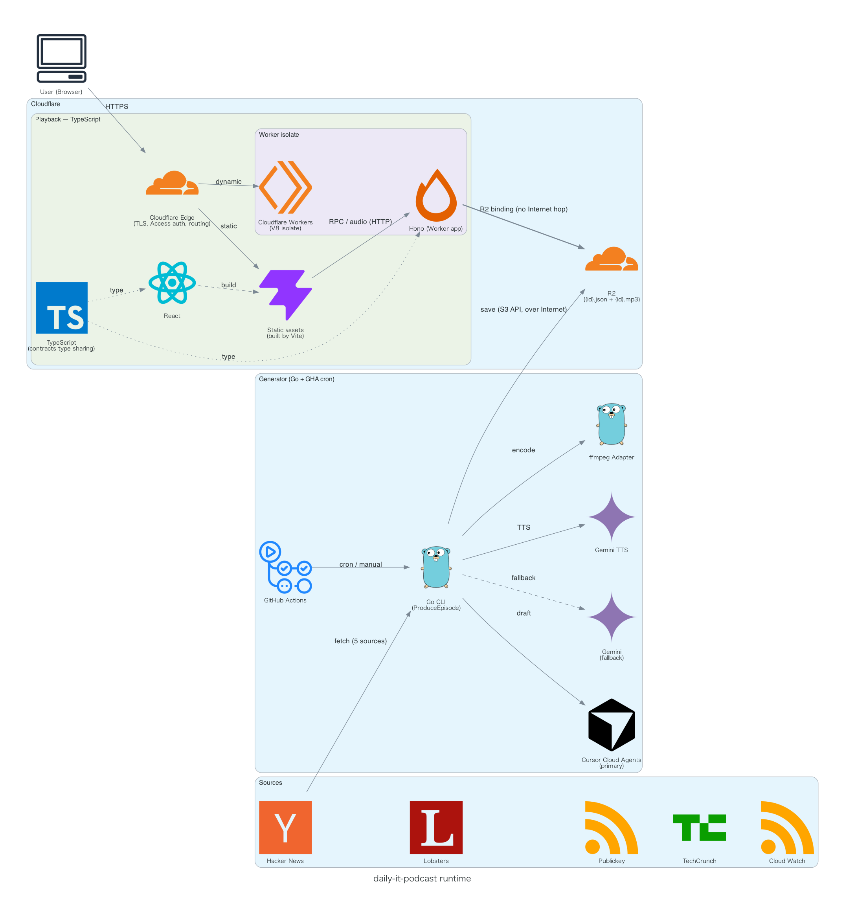

# daily-it-podcast

A personal daily IT-news podcast: generated automatically and listened to only by me. Not a commercial or public service.

## Scope of this file

This file answers **"what is this repo, where do I start."** It is the map, not the source of truth for any single topic.

| What you want | Source of truth |
|------|------|
| Layers, dependencies, technology choices, test layout | `DESIGN.md` |
| Deploy, Access, GHA operation, secret registration | `DEPLOY.md` |
| R2 file contracts（配置。音声 mp3） | `contracts/` |
| Playback HTTP contracts | `apps/playback/contracts/` |
| Open-work index | `docs/tasks/todo/*-lane.md` |
| Recurring decisions | `docs/decisions/` |

Non-scope: technology choices, layer boundaries, credential registration, workflow schedules. This file never restates values owned by the tables above; it links to them.

## Shape

Generation and playback are separate systems, connected only by files on shared storage (Cloudflare R2). Episodes are never generated through the UI.

```text
Generator (Go + GitHub Actions cron)
  fetch -> manuscript -> speech -> save
        |
  shared storage (audio + manuscript)
        |
Playback (Vite + React + Cloudflare Workers)
  Access -> UI -> Workers (proxy for storage reads)
```

## Runtime diagram
　

## Repository

```text
apps/playback/contracts/ # web <-> worker HTTP
apps/playback/web/       # Vite UI
apps/playback/worker/    # BFF
apps/generator/          # Go CLI
apps/diagrams/           # runtime diagram (code-first)
contracts/               # representation on R2 (SSOT)
.github/workflows/
```

## Branches

| Branch | Role |
|--------|------|
| `develop` | SSOT |
| `master` | release |

`feature/*` -> PR (base: `develop`) -> `master` is released by shim.

## Usage

1. **Playback:** enter through Access -> list -> play / show manuscript. Steps in `DEPLOY.md`.
2. **Generation:** GHA schedule / manual. Never started from the UI. Artifacts follow `contracts/`. Operation in `DEPLOY.md`.
3. **Playback local:** `cd apps/playback && npm ci && npm run dev` (Node version from `.nvmrc`).
4. **Generator:** Go module at `apps/generator/go.mod`. Put `golangci-lint` on PATH.
5. **Hooks:** `./scripts/install-hooks.sh`.
6. **Verification entry points:** `./scripts/check-static.sh` / `./scripts/test-unit.sh` / `./scripts/test-integration.sh` (details and thresholds in `DESIGN.md`; credentialed and scheduled E2E in `DEPLOY.md`).

## Constraints

- Private; no custom database; no multi-user.
- No unauthorized push to `master`. Production deploy policy is in `DEPLOY.md`.
